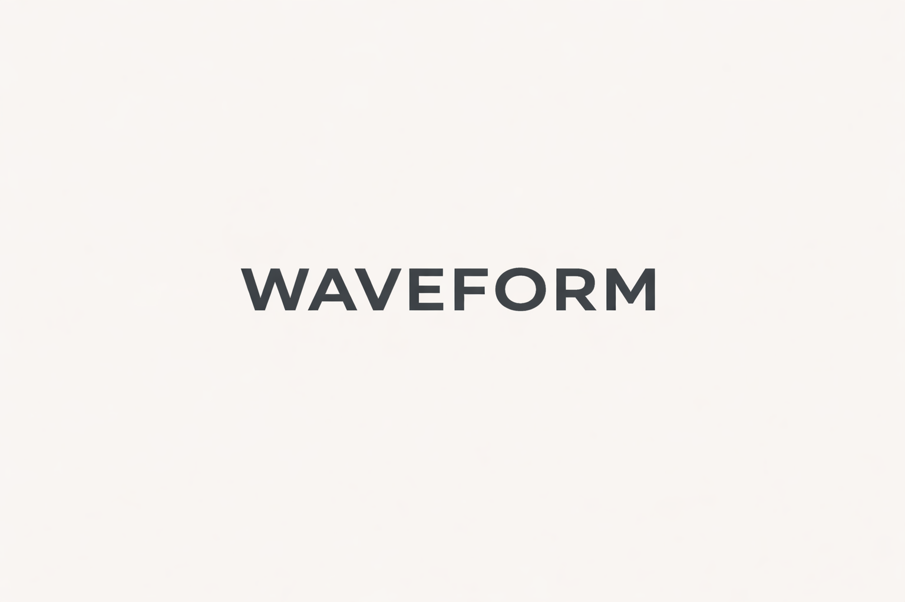
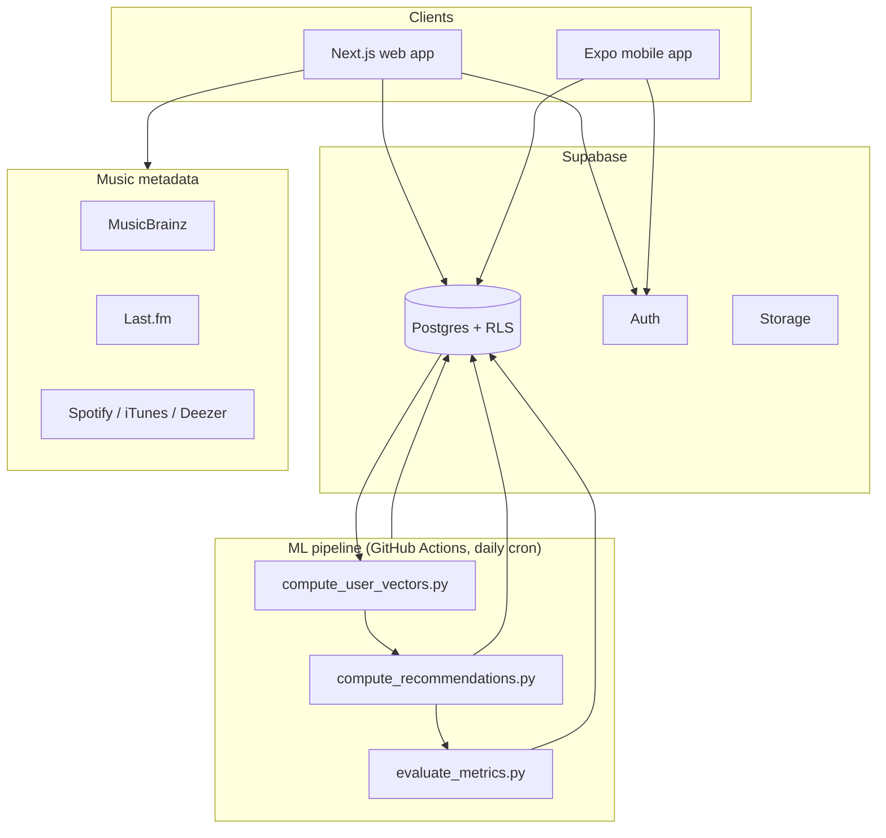

<p align="center">
  
</p>

<h1 align="center">Sillon</h1>
<p align="center">A social music discovery platform — track your listening, rate albums and tracks, and see what your friends are into.</p>

<p align="center">
  
  
  
  
  
</p>

---

## Overview

Sillon is a personal, production-oriented project: a music diary and social discovery
app, similar in spirit to Letterboxd but for music. Users log listens, rate albums and
tracks, follow each other, and get personalized recommendations computed by a batch ML
pipeline.

It's a monorepo with three moving parts:

- **`apps/web`** — Next.js 15 web app (App Router), the main product surface.
- **`apps/mobile`** — React Native / Expo mobile app, sharing the same Supabase backend.
- **`ml`** — a scheduled recommendation pipeline (collaborative filtering → hybrid →
  matrix factorization), running independently of the request path.

No custom backend server: business logic lives in Next.js Server Actions and Supabase
(Postgres + Auth + Storage + Row-Level Security), and the ML pipeline writes precomputed
results that the app reads directly.

## Screenshots

> _Coming soon — feed, album diary, and profile stats screens._

## Architecture



## Recommendation pipeline

The recommendation system runs as a **daily batch job**, not a live service — it reads
listening history from Postgres, computes recommendations offline, and writes ranked
results back for the app to read directly.

| Phase | Approach |
|---|---|
| **0 (current)** | User-based collaborative filtering: mean-centered rating vectors, cosine similarity between users, weighted score aggregation over nearest neighbors |
| **1** | Hybrid CF + content-based scoring (genre vectors), `0.7 × CF + 0.3 × content` |
| **2** | Matrix factorization (SVD / ALS via `implicit`) on explicit + implicit signals, latent factors stored in `pgvector` |

Quality is measured offline with leave-one-out cross-validation (Precision@K, Recall@K,
NDCG@K), stored in `recommendation_metrics` and queryable from an admin endpoint.
Full detail: [`ml/README.md`](ml/README.md).

## Tech stack

| Layer | Technology |
|---|---|
| Web frontend | Next.js 15 (App Router), Tailwind CSS v4 |
| Mobile | React Native (Expo) |
| Auth & database | Supabase (Postgres + Auth + Storage), Row-Level Security on every table |
| Recommendations | Python — pandas / scipy / `implicit`, scheduled via GitHub Actions |
| Music metadata | MusicBrainz, Last.fm, iTunes Search, Deezer |
| Observability | Sentry |
| Deployment | Vercel (web), EAS (mobile) |

## Getting started

### Prerequisites

- Node.js 20+
- A Supabase project (free tier is enough for local development)

### Web app

```bash
git clone https://github.com/KenJend0/sillon.git
cd sillon/apps/web
npm install
cp .env.example .env.local   # fill in the values below
npm run dev
# → http://localhost:3000
```

Required environment variables:

```env
NEXT_PUBLIC_SUPABASE_URL=
NEXT_PUBLIC_SUPABASE_ANON_KEY=
SUPABASE_SERVICE_KEY=
```

Optional (feature flags — the app degrades gracefully if these are omitted):

```env
LASTFM_API_KEY=                     # genre + description enrichment
SPOTIFY_CLIENT_ID=                  # streaming links
SPOTIFY_CLIENT_SECRET=
UPSTASH_REDIS_REST_URL=             # rate limiting (fail-open if absent)
UPSTASH_REDIS_REST_TOKEN=
```

### Mobile app

```bash
cd apps/mobile
npm install
cp .env.example .env.local
npx expo start
```

### ML pipeline

```bash
cd ml
pip install -r requirements.txt
cp .env.example .env
python scripts/compute_user_vectors.py --dry-run
```

## Database

Schema and Row-Level Security policies are defined in
[`supabase_migrations/supabase_schema.sql`](supabase_migrations/supabase_schema.sql).

**Core tables:**

| Table | Purpose |
|---|---|
| `profiles` | User metadata (username, bio, avatar) |
| `albums` / `artists` / `tracks` | Music catalog |
| `diary_entries` / `track_diary_entries` | Listens and reviews |
| `follows` | Social graph |
| `feed_events` | Activity feed (write-time fan-out) |
| `lists` | User-curated album lists |
| `genres` / `album_metadata` | Enriched metadata from external APIs |
| `recommendations` / `user_recommendations` | Output of the ML pipeline |
| `search_cache` | 24h cache of MusicBrainz search results |

RLS is enabled on every table; server-side writes (feed fan-out, metadata enrichment)
use the service-role key only from trusted server contexts, never exposed to the client.

## Key design decisions

- **No custom backend.** Server Actions + Supabase cover all business logic, keeping the
  system easy to reason about and deploy.
- **Offline recommendations.** Computing recs as a scheduled batch job rather than
  on-request keeps read latency low and makes the ML pipeline independently testable and
  versioned, separate from the product codebase.
- **Two-phase search.** Internal full-text search (Postgres `tsvector` + `unaccent`,
  fuzzy fallback via `pg_trgm`) returns instantly; MusicBrainz results are merged in as
  they arrive, ranked by a shared scoring function used by both the search overlay and
  the full search page.
- **Write-time fan-out for the feed.** Each social action inserts a row per follower at
  write time, so reading a feed is a single indexed query instead of a fan-in join at
  read time.

## Roadmap

The web app is in production. See [`docs/ROADMAP.md`](docs/ROADMAP.md) for what's next,
including the mobile app rollout.
